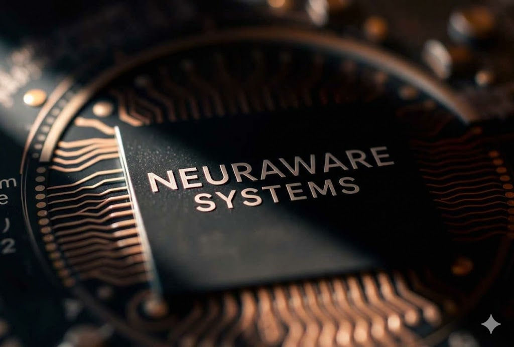

<div align="center">



# Neuraware Systems Private Limited

### AI-Powered Cardiac Diagnostics. On a Chip.

[](#)
[](https://in.linkedin.com/in/md-samsh-tabrej)
[](#)

---

*We build FPGA-based Edge AI systems that detect heart disease with clinical-grade accuracy — no cloud, no latency, no compromise.*

</div>

---

## The Problem

Cardiovascular disease is the world's leading cause of death. Early detection saves lives — but access to accurate, real-time cardiac diagnostics remains limited to expensive hospital infrastructure. Millions go undiagnosed simply because the technology isn't where they are.

## Our Solution

Neuraware Systems brings hospital-grade cardiac analysis to the edge. We combine **AI inference**, **hardware accelerators**, and **FPGA-based SoC architecture** to process ECG data locally on-device — delivering fast, accurate heart disease detection from the comfort of home.

No cloud dependency. No internet required. Just silicon that saves lives.

---

## About This Repository

This repository contains the source code for the **official Neuraware Systems website** — our public-facing digital presence showcasing our technology, mission, and initiatives.

### Tech Stack

| Layer | Technology |
|-------|-----------|
| Structure | HTML5 |
| Styling | CSS3 |
| Interactivity | JavaScript |

### Project Structure

```
NeurawareWeb/
├── index.html          # Main website entry point
├── css/                # Stylesheets
├── js/                 # Scripts and interactivity
├── assets/             # Images, icons, and media
└── README.md           # You are here
```

---

## What We Build

**🔬 NeuraCardio SoC** — Our flagship FPGA-based System-on-Chip platform for real-time cardiac AI inference at the edge.

**⚡ Edge AI Engine** — Custom hardware-accelerated inference pipeline optimized for biomedical signal processing.

**📊 ECG Signal Pipeline** — End-to-end signal acquisition, filtering, and feature extraction — entirely on-chip.

**🧠 Cardiac AI Models** — Deep learning models trained for maximum diagnostic accuracy, optimized for deployment on resource-constrained hardware.

---

## Young Innovators Initiative (YII)

> *"The chip designers of 2035 are in Class 10 today."*

We're on a mission to prepare India's youth for the semiconductor revolution — before it arrives. Our **Young Innovators Initiative** introduces students to the world of electronics, VLSI design, and hardware engineering through hands-on programmes and mentorship.

Because Atmanirbhar Bharat starts in the classroom.

---

## Leadership

**Mohammed Samsh Tabrej** — *Founder & Director*

Building at the intersection of AI, silicon, and healthcare. Leading Neuraware's vision to make cardiac diagnostics universally accessible through edge computing and custom hardware.

[](https://in.linkedin.com/in/md-samsh-tabrej)

---

## Getting Started

To run the website locally:

```bash
# Clone the repository
git clone https://github.com/MdAli101/NeurawareWeb.git

# Navigate to the project
cd NeurawareWeb

# Open in your browser
open index.html
# or simply double-click index.html
```

No build tools or dependencies required — it's pure HTML, CSS, and JavaScript.

---

## Contributing

We welcome contributions that improve the website experience. If you'd like to contribute:

1. Fork the repository
2. Create your feature branch (`git checkout -b feature/your-feature`)
3. Commit your changes (`git commit -m 'Add your feature'`)
4. Push to the branch (`git push origin feature/your-feature`)
5. Open a Pull Request

---

## Contact

📧 **Email:** [contact@neuraware.in](mailto:contact@neuraware.in)
🌐 **Website:** [neuraware.in](#)
💼 **LinkedIn:** [Mohammed Samsh Tabrej](https://in.linkedin.com/in/md-samsh-tabrej)

---

<div align="center">

**Neuraware Systems Private Limited**

*Silicon meets stethoscope.*
</div>